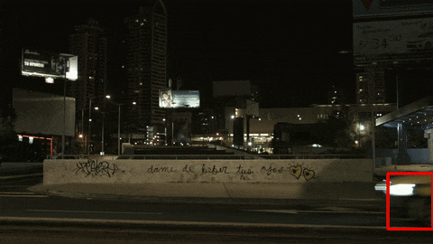

# :fontawesome-solid-book:Documentation

## :fontawesome-solid-terminal:Running DVR-Scan

After installation, the `dvr-scan` command should be available from a terminal or command prompt. Try running `dvr-scan --help`. The UI can be launched by running `dvr-scan-app`. See the [User Guide](guide.md) for information on how to use the UI.

!!! info "For portable versions, replace `dvr-scan` with the path to `dvr-scan.exe` in the extracted files on your system. The UI can be launched by running `dvr-scan-app.exe`."

To extract all motion events from a video, you can start with:

    dvr-scan -i video.mp4

This will produce output events in your working directory starting with the prefix `video.DSME_` (e.g. `video.DSME_0001.avi`). If you want to limit scanning to a particular part of the video frame, you can use the [region editor](#region-editor):

    dvr-scan -i video.mp4 -r

DVR-Scan should provide good results for most use cases, but can be fine tuned for specific use cases. There are two main categories of these settings: [detection and sensitivity](#detection), and [event parameters](#events).

Most program options can be set [using a config file](#config-file).  DVR-Scan also looks for a `dvr-scan.cfg` file in the following locations:

 * Windows: `C:/Users/%USERNAME%/AppData/Local/DVR-Scan/dvr-scan.cfg`
 * Linux: `~/.config/DVR-Scan/dvr-scan.cfg` or `$XDG_CONFIG_HOME/dvr-scan.cfg`
 * OSX: `~/Library/Preferences/DVR-Scan/dvr-scan.cfg`

These settings will be used by default each time you run DVR-Scan, unless you override them. Selecting the Settings -> Save As User Default option in the UI will overwrite this file.

### Multiple Videos

You can specify multiple input videos as long as they have the same resolution and framerate:

    dvr-scan -i video1.mp4 video2.mp4 video*.mp4

Wildcards are also supported:

    dvr-scan -i video*.mp4

Note that this will **concatenate** the videos together *in the order they are specified*.

This can be undesirable for some types of footage being analyzed.  For example, if a folder contains different dashcam footage clips, a significant amount of time can pass between clips (e.g. when the vehicle is shut off).  This can result in DVR-Scan generating false events between videos.

To avoid this, you can run DVR-Scan on each video in a loop. For example, on Windows:

    for /F %i in ('dir *.mp4 /b') do dvr-scan -i %i

Or on Linux/OSX:

    for f in /mnt/videos/*.mp4
    do
        dvr-scan -i $f
    done

Note that multiple inputs also do not support other output modes. You can use `ffmpeg` to [concatenate all input videos](https://trac.ffmpeg.org/wiki/Concatenate) before processing, or use a for-loop as above.

### Output Format

By default, DVR-Scan uses the OpenCV VideoWriter for video output. This usually requires the output files be in .AVI format of some kind.

DVR-Scan also supports using `ffmpeg` to extract motion events. This is done by setting `-m`/`--output-mode` to `ffmpeg` (reencode) or `copy` (codec copy mode, may not be frame accurate). For example:

    dvr-scan -i video.mp4 -m ffmpeg

You can customize the options passed to `ffmpeg` using a [config file](#config-file) (see [the `ffmpeg-input-args` and `ffmpeg-output-args`](#output_1)) settings).

Setting output mode to `ffmpeg` or `copy` has the following caveats:

 - inputs that have a variable framerate (VFR) may not be  extracted reliably
 - input concatenation is not supported
 - overlays are not supported

### VFR (Variable Framerate)

!!! warning "Variable framerate (VFR) video support is still under development and may produce incorrect results."

Variable framerate (VFR) videos are *not well supported*, but basic functionality does work. Motion detection and event extraction should work correctly with default settings. Note however that calculated timestamps may be incorrect, and extracted footage may playback at the wrong speed.

Frame numbers will be accurate, but timestamps will not.  This can yield incorrect results when setting output mode to `ffmpeg` or `copy`, as well as inaccurate timestamps when using overlays. This issue is [tracked on Github](https://github.com/Breakthrough/PySceneDetect/issues/168).  If this workflow is required, you can re-encode the source material into fixed framerate before processing.

## :fontawesome-solid-terminal:`dvr-scan` Options

Most options are accessible through the UI, config files, and the command-line interface.

### General

 * <b><pre>-h, --help</pre></b>
    Show help message and all options and default values. Will also show any options overriden by your [user config file](#config-file), if set.

 * <b><pre>-V, --version</pre></b>
    Show version information.

 * <b><pre>-L, --license</pre></b>
    Show copyright information.

The following options control terminal output:

 * <b><pre>--logfile log.txt</pre></b>
    File to save (append) log output.

 * <b><pre>-q, --quiet</pre></b>
    Suppress all console output except for final cutting list.

 * <b><pre>-v, --verbosity</pre></b>
    Set verbosity of output messages, must be one of: <b><pre>debug, info, warning, error</pre></b>
    <span class="dvr-scan-default">
    ```
    --verbosity info
    ```
    </span>


### Input

 * <b><pre>-i video.mp4, --input video.mp4</pre></b>
    Path to input video. May specify multiple input videos so long as they have the same resolution and framerate. Wildcards/globs are supported (e.g. `-i folder/*.mp4`). Extracted motion events use the filename of the first video only as a prefix.

 * <b><pre>-c settings.cfg, --config settings.cfg</pre></b>
    Path to config file. If not set, tries to load one automatically from the user settings folder (run `dvr-scan --help` to see the exact path for your system). See the [config file documentation](#config-file) for what options can be specified.


#### Regions

Detection can be limited to specific regions of the frame. This can be done interactively using the `-r/--region-editor` flag, or by providing a list (`-a/--add-region`) or file (`-R/--load-region`) containing polygon data.

Regions are specified as a list of points (X, Y) forming a closed polygon (shape with at least 3 points). For example, a triangle is defined as `0 0 100 0 50 50`. Multiple regions can be combined, and the result can also be saved to a file using `-s/--save-region`.

!!! tip "Setting a smaller region of interest can improve scanning performance."

 * <b><pre>-r, --region-editor</pre></b> Display region editor before processing. Press `H` to show controls in your terminal. See [the user guide](guide.md#region-editor) for more details.
<span class="dvr-scan-example">
```
dvr-scan -i video.mp4 -r
```
</span>

 * <b><pre>-a, --add-region</pre></b>Add a region to the scan. Regions are defined by a list of points (min. 3) that enclose the scanning region.
<span class="dvr-scan-example">
```
dvr-scan -i video.mp4 -a 50 50 100 50 75 75
```
</span>

 * <b><pre>-s, --save-region</pre></b>Save region data for this scan. Include all regions added or loaded via command line, and any edits made with the region editor if launched.
<span class="dvr-scan-example">
```
dvr-scan -i video.mp4 -r -s regions.txt
```
</span>

 * <b><pre>-R, --load-region</pre></b>Load region data an existing file.
<span class="dvr-scan-example">
```
dvr-scan -i video.mp4 -R regions.txt
```
</span>


#### Seeking/Duration

All time values can be given as a timecode (`HH:MM:SS` or `HH:MM:SS.nnn`), in seconds as a number followed by `s` (`123s` or `123.45s`), or as number of frames (e.g. `1234`).
<span class="dvr-scan-example">
```
dvr-scan -i video.mp4 --start-time 00:35:52 --duration 00:05:00
```
</span>

 * <b><pre>-st time, --start-time time</pre></b>Timecode in video to start motion detection from

 * <b><pre>-dt time, --duration time</pre></b> Maximum duration of input to process.

 * <b><pre>-et time, --end-time time</pre></b> Timecode to stop processing input.


#### Frame Processing

 * <b><pre>--use-pts</pre></b> Use presentation time instead of frame number for timestamps. May improve timestamp accuracy with videos and network streams that may skip frames.

 * <b><pre>-df factor, --downscale-factor factor</pre></b> Integer factor to shrink video before processing, to improve performance. For example, if input video resolution is 1024 x 400, and `-df=2`, each frame is reduced to 512 x 200 before processing. Uses subsampling for downscaling.
<span class="dvr-scan-example">
```
--downscale-factor 2
```
</span>

 * <b><pre>-fs num_frames, --frame-skip num_frames</pre></b> Number of frames to skip after processing a given frame. Improves performance, at expense of frame and time accuracy, and may increase probability of missing motion events. If set, `-l`/`--min-event-length`, `-tb`/`--time-before-event`, and `-tp`/`--time-post-event` will all be scaled relative to the source framerate. Values above 1 or 2 are not recommended.
<br/><br/>When using the default output mode (`opencv`), skipped frames are not included. Set `-m`/`--output-mode` to `ffmpeg` or `copy` to include all frames from the input video when writing motion events to disk.
<br/><br/>Although adjusted for frame skipping, bounding box smoothing may be inconsistent when using frame skipping. Set `-bb 0` to disable smoothing.
<span class="dvr-scan-example">
```
--frame-skip 1
```
</span>

!!! warning "Using `downscale-factor` and `frame-skip` may reduce the accuracy of motion detection if set too high."

### Motion

All time values can be given as a timecode (`HH:MM:SS` or `HH:MM:SS.nnn`), in seconds as a number followed by `s` (`123s` or `123.45s`), or as number of frames (e.g. `1234`). When modifying detection options, it can be useful to generate a motion mask (`-mo mask.avi`) to visually see how DVR-Scan processes the input.

 * <b><pre>-l time, --min-event-length time</pre></b> Amount of time/frames that must have a motion score above the threshold setting before triggering a new event.
<span class="dvr-scan-default">
```
--min-event-length 2
```
</span>

 * <b><pre>-tb time, --time-before-event time</pre></b> Maximum amount of time to include before each event.
<span class="dvr-scan-default">
```
--time-before-event 1.5s
```
</span>

 * <b><pre>-tp time, --time-post-event time</pre></b> Maximum amount of time to include after each event. The event will end once no motion has been detected for this period of time.
<span class="dvr-scan-default">
```
--time-post-event time 2.0s
```
</span>

 * <b><pre>-t value, --threshold value</pre></b> Minimum amount of motion a frame must have to trigger an event. Lower values are more sensitive to motion, and require less movement to trigger an event. If too high, some movement may not be detected. Setting too low of a threshold can result in false detections. May require adjustment if other motion settings are changed.
<span class="dvr-scan-default">
```
--threshold 0.15
```
</span>


#### Advanced

 * <b><pre>-b type, --bg-subtractor type</pre></b> The type of background subtractor to use. Must be one of:

    * <b><pre style="display:inline;">MOG2</pre></b> :&nbsp; [MOG2 Background Subtractor](https://docs.opencv.org/3.4/d7/d7b/classcv_1_1BackgroundSubtractorMOG2.html)

    * <b><pre style="display:inline;">CNT</pre></b> :&nbsp; [CNT Background Subtractor](https://docs.opencv.org/3.4/de/dca/classcv_1_1bgsegm_1_1BackgroundSubtractorCNT.html), faster than `MOG` but uses different method, so may need to adjust threshold/kernel size

    * <b><pre style="display:inline;">MOG2_CUDA</pre></b> :&nbsp; [Nvidia CUDA®-based version of MOG2](https://docs.opencv.org/3.4/df/d23/classcv_1_1cuda_1_1BackgroundSubtractorMOG2.html). Requires an OpenCV installation that was compiled with CUDA support.

    <span class="dvr-scan-default">
    ```
    --bg-subtractor MOG2
    ```
    </span>


 * <b><pre>-k size, --kernel-size size</pre></b> Noise reduction kernel size, in pixels.  Kernel size can be increased to filter out smaller movements from a scene. Must be an *odd* integer at least `3` or greater. Can also be set to `0` to disable, or `-1` to select automatically based on input resolution. Auto sizes are `7` for 1080p or higher, `5` for 720p, and `3` for 480p or lower.
<span class="dvr-scan-example">
```
--kernel-size 5
```
</span>


### Output

 * <b><pre>-so, --scan-only</pre></b> Do not save/extract events, only perform motion detection and display results.

 * <b><pre>-d path, --output-dir path</pre></b> Write all output files to `path`. If not specified, files are written in the working directory.

 * <b><pre>-m mode, --output-mode mode</pre></b> Mode to use for saving motion events. Must be one of:

    * <b><pre style="display:inline;">opencv</pre></b> :&nbsp; Use OpenCV for saving motion events. Requires .AVI output format.

    * <b><pre style="display:inline;">ffmpeg</pre></b> :&nbsp; Use ffmpeg for saving motion events. Ffmpeg encoder args can be set using a [config file](#config-file) (see the `ffmpeg-input-args` and `ffmpeg-output-args` options).

    * <b><pre style="display:inline;">copy</pre></b> :&nbsp; Same as `ffmpeg`, but using stream copying mode (no reencoding). Can potentially create inaccurate events due to keyframe placement.

    <span class="dvr-scan-default">
    ```
    -m opencv
    ```
    </span>

!!! warning "Multiple input files are not supported when `-m`/`--output-mode` is set to `ffmpeg` or `copy`. You can use `ffmpeg` to [concatenate all input videos](https://trac.ffmpeg.org/wiki/Concatenate) *before* using DVR-Scan, or [run DVR-Scan in a for-loop](guide.md#multiple-videos)."

 * <b><pre>-o video.avi, --output video.avi</pre></b> Save all motion events to a single file, instead of the default (one file per event). Only supported with the default output mode (`opencv`). Requires `.avi` extension.

 * <b><pre>-mo mask.avi, --mask-output mask.avi</pre></b> Save a video containing the calculated motion mask on each frame. Useful for tuning motion detection. Requires `.avi` extension.

 * <b><pre>--thumbnails highscore</pre></b> Save a thumbnail of the frame with the highest motion score for each event.

#### Overlays



!!! note "Overlays are only supported when output mode is set to OpenCV."

 * <b><pre>-bb, --bounding-box</pre></b> Draw a bounding box around the areas where motion is detected.
<br/>An optional amount of time for temporal smoothing can also be specified (e.g. `-bb 0.1s`). The default smoothing amount is 0.1 seconds. If set to 0 (`-bb 0`), smoothing is disabled.
<br/>The color, thickness, and minimum size can be set with a [config file](#overlays_1).

 * <b><pre>-tc, --time-code</pre></b>  Draw time code of each frame on the top left corner.
<br/>Text properties (e.g. color, font size, margin) can be set with a [config file](#overlays_1).

 * <b><pre>-fm, --frame-metrics</pre></b>  Draw frame metrics, including motion score, on the top right corner.
<br/>Text properties (e.g. color, font size, margin) can be set with a [config file](#config-file).

------------------------------------------------

## :fontawesome-regular-file:Config File

Settings are specified one per line as `option = value`. Lines starting with `#` are ignored as comments. The [`dvr-scan.cfg` config template](https://raw.githubusercontent.com/Breakthrough/DVR-Scan/releases/1.6/dvr-scan.cfg) can be saved and used as a starting point (it includes the information in this section as comments).

Configuration options are set as `option = value`, and lines starting with `#` are ignored as comments. For example:

```
# This is an example of a DVR-Scan config file.
# Lines starting with # are treated as comments.
time-before-event = 0.5s
time-post-event = 2.0s
bounding-box = yes
bounding-box-color = 0xFF0000
```


### General

 * <b><pre>region-editor</pre></b>
    Always show region editor window before scanning.
    <span class="dvr-scan-default">
    ```
    region-editor = no
    ```
    </span>

 * <b><pre>quiet-mode</pre></b>
    Suppress all console output.
    <span class="dvr-scan-default">
    ```
    quiet-mode = no
    ```
    </span>

 * <b><pre>verbosity</pre></b>
   Verbosity of console output (`debug`, `info`, `warning`, `error`). If set to `debug`, overrides `quiet-mode` unless set via command line.
    <span class="dvr-scan-example">
    ```
    verbosity = info
    ```
    </span>

#### Logging

 * <b><pre>save-log</pre></b>
   Save a detailed log for each run of DVR-Scan. Each log file is named using a timestamp in the format `dvr-scan-YYYY-MM-DD-HH-MM-SS-RANDOM.log`. For the GUI, the prefix `dvr-scan-app` is used instead.
    <span class="dvr-scan-default">
    ```
    save-log = yes
    ```
    </span>

 * <b><pre>max-log-files</pre></b>
   Maximum number of log files to keep. Set to 0 to keep all log files.
    <span class="dvr-scan-default">
    ```
    max-log-files = 4
    ```
    </span>


### Input


 * <b><pre>input-mode</pre></b>
    Which mode to use for decoding frames: (`opencv`, `pyav`, `moviepy`).
    <span class="dvr-scan-default">
    ```
    input-mode = opencv
    ```
    </span>

 * <b><pre>use-pts</pre></b>
    Use presentation time instead of frame number for timestamps. May improve timestamp accuracy with videos and network streams that may skip frames.
    <span class="dvr-scan-example">
    ```
    use-pts = yes
    ```
    </span>

 * <b><pre>downscale-factor</pre></b>
    Integer factor to shrink video before processing. Values <= 1 disable downscaling. Leave unset for auto.
    <span class="dvr-scan-example">
    ```
    downscale-factor = 2
    ```
    </span>

 * <b><pre>frame-skip</pre></b>
    Number of frames to skip between processing when looking for motion events.
    <span class="dvr-scan-default">
    ```
    frame-skip = 0
    ```
    </span>


### Output


 * <b><pre>output-dir</pre></b>
    Directory to output all created files. If unset, files will be created in the current working directory.
    <span class="dvr-scan-example">
    ```
    output-dir = C:/temp/scanned/
    ```
    </span>

 * <b><pre>output-mode</pre></b>
    Method of generating output videos: (`scan_only`, `opencv`, `ffmpeg`, `copy`). Not all features are supported in all modes.
    <span class="dvr-scan-default">
    ```
    output-mode = opencv
    ```
    </span>

!!! warning "Multiple input files are not supported when `-m`/`--output-mode` is set to `ffmpeg` or `copy`. You can use `ffmpeg` to [concatenate all input videos](https://trac.ffmpeg.org/wiki/Concatenate) *before* using DVR-Scan, or [run DVR-Scan in a for-loop](guide.md#multiple-videos)."

 * <b><pre>ffmpeg-input-args</pre></b>
    Arguments added before the input to `ffmpeg` when *output-mode* is *ffmpeg* or *copy*. Note that *-y* and *-nostdin* are always added.
    <span class="dvr-scan-default">
    ```
    ffmpeg-input-args = -v error
    ```
    </span>

 * <b><pre>ffmpeg-output-args</pre></b>
    Encoder parameters used when generating output files when *output-mode* is *ffmpeg*. These arguments are added after the input and duration.
    <span class="dvr-scan-default">
    ```
    ffmpeg-output-args = -map 0 -c:v libx264 -preset fast -crf 21 -c:a aac -sn
    ```
    </span>

 * <b><pre>opencv-codec</pre></b>
    Four-letter identifier of the encoder/video codec to use when *output-mode* is *opencv*. Must be one of: (`XVID`, `MP4V`, `MP42`, `H264`).
    <span class="dvr-scan-default">
    ```
    opencv-codec = XVID
    ```
    </span>

 * <b><pre>verbosity</pre></b>
    Verbosity of console output: (`debug`, `info`, `warning`, `error`).
    <span class="dvr-scan-default">
    ```
    verbosity = info
    ```
    </span>

 * <b><pre>quiet-mode</pre></b>
    Suppress all console output: (`yes` or `no`). Only a final comma-separated list of timecodes will be printed if set to `yes`.
    <span class="dvr-scan-default">
    ```
    quiet-mode = no
    ```
    </span>


### Motion

All time values can be given as a timecode: (`HH:MM:SS` or `HH:MM:SS.nnn`), in seconds as a number followed by `s` (`123s` or `123.45s`), or as number of frames: (`1234`).

 * <b><pre>min-event-length</pre></b>
    Amount of time which must have motion in each frame to trigger an event.
    <span class="dvr-scan-default">
    ```
    min-event-length = 2
    ```
    </span>

 * <b><pre>time-before-event</pre></b>
    Amount of time to include before a motion event.
    <span class="dvr-scan-default">
    ```
    time-before-event = 1.5s
    ```
    </span>

 * <b><pre>time-post-event</pre></b>
    Amount of time to include after an event.
    <span class="dvr-scan-default">
    ```
    time-post-event = 2.0s
    ```
    </span>


 * <b><pre>threshold</pre></b>
    Threshold representing amount of motion in a frame (or the ROI, if set) for a motion event to be triggered.
    <span class="dvr-scan-default">
    ```
    threshold = 0.15
    ```
    </span>

#### Advanced

 * <b><pre>bg-subtractor</pre></b>
    Type of background subtraction to use: (`MOG2`, `CNT`, `MOG2_CUDA`).
    <span class="dvr-scan-default">
    ```
    bg-subtractor = MOG2
    ```
    </span>

 * <b><pre>max-threshold</pre></b>
     Scores of this amount or higher are ignored. 255.0 is the maximum score, so values greater than 255.0 will disable the filter.
    <span class="dvr-scan-default">
    ```
    max-threshold = 255.0
    ```
    </span>

 * <b><pre>variance-threshold</pre></b>
     Threshold on the distance between the pixel and the model to decide whether a pixel is well described by the background model. This parameter does not affect
     the background update.<br />
     The threshold is not used by the CNT subtractor.
    <span class="dvr-scan-default">
    ```
    variance-threshold = 16
    ```
    </span>

 * <b><pre>kernel-size</pre></b>
    Size (in pixels) of the noise reduction kernel. Size must be an odd number starting from 3, 0 to disable, or -1 to auto-set based on video resolution.
    <span class="dvr-scan-default">
    ```
    kernel-size = -1
    ```
    </span>

 * <b><pre>learning-rate</pre></b>
    The value between 0 and 1 that indicates how fast the background model is learnt. Negative parameter value makes the algorithm to use some automatically chosen learning rate. 0 means that the background model is not updated at all, 1 means that the background model is completely reinitialized from the last frame.
    <span class="dvr-scan-default">
    ```
    learning-rate = -1
    ```
    </span>

 * <b><pre>max-area</pre></b>
     Events whose bounding boxes have relative area bigger than this are ignored. Maximum area is 1.0 (relative area of the whole frame), so values equal or greater than 1.0 will disable this filter.

    <span class="dvr-scan-default">
    ```
    max-area = 1.0
    ```
    </span>

 * <b><pre>max-width</pre></b>
     Events whose bounding boxes have relative width bigger than this are ignored. Maximum width is 1.0 (whole frame), so values equal or greater than 1.0 will disable this filter.

    <span class="dvr-scan-default">
    ```
    max-width = 1.0
    ```
    </span>

 * <b><pre>max-height</pre></b>
     Events whose bounding boxes have relative height bigger than this are ignored. Maximum height is 1.0 (whole frame), so values equal or greater than 1.0 will disable this filter.

    <span class="dvr-scan-default">
    ```
    max-height = 1.0
    ```
    </span>

### Overlays

Color values can be specified as either `(R,G,B)` or in hex as `0xFFFFFF`. Time values can be given in seconds as a number followed by `s` (`123s` or `123.45s`), or as number of frames (e.g. `1234`).

#### Bounding Box Overlays

* <pre>bounding-box</pre></b>
    Enable bounding box: (`yes` or `no`).
    <span class="dvr-scan-example">
    ```
    bounding-box = yes
    ```
    </span>

* <b><pre>bounding-box-color</pre></b>
    Box edge color specified as `R, G, B`.
    <span class="dvr-scan-default">
    ```
    bounding-box-color = 255, 0, 0
    ```
    </span>

* <b><pre>bounding-box-thickness</pre></b>
    Thickness of bounding box, relative to largest edge of input video.
    <span class="dvr-scan-default">
    ```
    bounding-box-thickness = 0.0032
    ```
    </span>

* <b><pre>bounding-box-smooth-time</pre></b>
    Amount of temporal smoothing to apply (seconds or frames).
    <span class="dvr-scan-default">
    ```
    bounding-box-smooth-time = 0.1s
    ```
    </span>

* <b><pre>bounding-box-min-size</pre></b>
    Minimum side length of bounding box, relative to largest edge of input video.
    <span class="dvr-scan-default">
    ```
    bounding-box-min-size = 0.032
    ```
    </span>


#### Text Overlays

 * <b><pre>time-code</pre></b>
    Enable timecode overlay: (`yes` or `no`). Draws timecode on top left of each frame.
    <span class="dvr-scan-example">
    ```
    time-code = yes
    ```
    </span>

 * <b><pre>frame-metrics</pre></b>
    Enable frame metrics overlay: (`yes` or `no`). Draws frame metrics, including motion score, on top right of each frame.
    <span class="dvr-scan-example">
    ```
    frame-metrics = yes
    ```
    </span>

 * <b><pre>text-border</pre></b>
    Margin from edge in pixels.
    <span class="dvr-scan-default">
    ```
    text-margin = 5
    ```
    </span>

 * <b><pre>text-margin</pre></b>
    Margin from edge in pixels.
    <span class="dvr-scan-default">
    ```
    text-margin = 5
    ```
    </span>

 * <b><pre>text-font-scale</pre></b>
    Scale factor for text size.
    <span class="dvr-scan-default">
    ```
    text-font-scale = 2.0
    ```
    </span>

 * <b><pre>text-font-thickness</pre></b>
    Thickness of font (integer values only).
    <span class="dvr-scan-default">
    ```
    text-font-thickness = 2
    ```
    </span>

 * <b><pre>text-font-color</pre></b>
    Text color specified as `R, G, B`.
    <span class="dvr-scan-default">
    ```
    text-font-color = 255, 255, 255
    ```
    </span>

 * <b><pre>text-bg-color</pre></b>
    Background color specified as `R, G, B`.
    <span class="dvr-scan-default">
    ```
    text-bg-color = 0, 0, 0
    ```
    </span>
