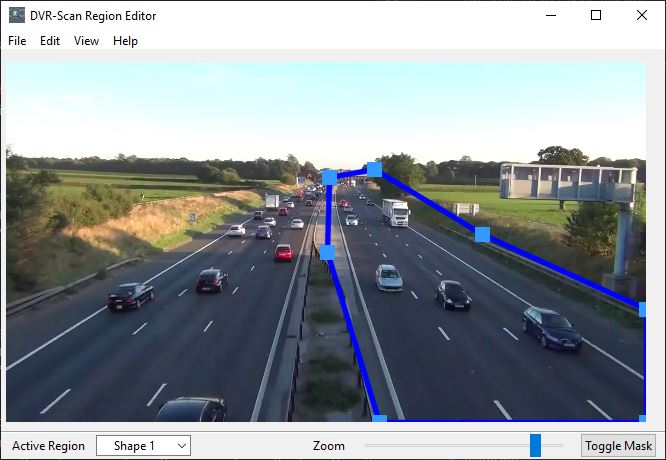

# :fontawesome-solid-circle-info: User Guide

## :fontawesome-solid-terminal:Running DVR-Scan

After installation, you can run DVR-Scan by clicking on the application shortcut, or running `dvr-scan-app` from a terminal. If you downloaded the portable version, run `dvr-scan-app.exe`.

!!! note "The `dvr-scan` command is the command-line interface for DVR-Scan. To launch the GUI, run `dvr-scan-app`. For help with the command-line interface or config files, see the [Documentation](docs.md) page for details. "

Start by clicking the <b>Add</b> button to add one or more videos:

To extract and save the motion events from the input, click the <b>Start</b> button. You will be prompted for a location to save the events to, after which scanning will begin:

Once complete, each event will be saved to the output folder you selected.  To tune motion sensitivity, go to <b>Settings -> Motion</b> and adjust threshold, where lower values are more sensitive to motion, and higher values are less sensitive.  You can also adjust event settings and more:

See [the config option documentation](docs.md#config-file) for a detailed description of each setting.

## :fontawesome-solid-crop-simple:Region Editor

The Region Editor allows you to limit motion detection to specific areas of the frame. Once you have a video loaded, check "Set Regions" and press the "Region Editor" button:

You can use the mouse to add or move points when editing regions. Left click to add a new point, or drag an existing one. Right click can be used to delete a point, and to add/remove shapes.

To begin scanning, close the region editor, and click the Start button.  You will be prompted to save the regions you have created before scanning so you can re-use them if required.

### Regions

Regions are a set of points creating a closed shape. A rectangle will be created by default for you to modify.

Regions are edited individually, but all regions are used when scanning. To add a new shape, right click anywhere on the frame.

Regions can be selected using the Active Region selector at the bottom left, or cycled by using the `Tab` key. Note that only one region can be edited at a time.

By enabling mask mode (Toggle Mask at the bottom right), you can see the exact areas of the frame that DVR-Scan will consider for motion:

Regions can be saved/loaded for reusing across videos or editing via the File menu.

### Controls

Click Help -> Show Controls or press `Ctrl + H` (`Command + H` on Mac) to display all keyboard and mouse controls. You can move the canvas by holding `Ctrl` (`Command` on Mac) and dragging with left-click. The cursor icon should change depending on what mode the editor is in.

Most actions have keyboard shortcuts displayed beside the menu item. You can undo/redo any modifications or deletions when working on the regions by clicking Edit -> Undo/Redo or using your system's undo/redo keys.
