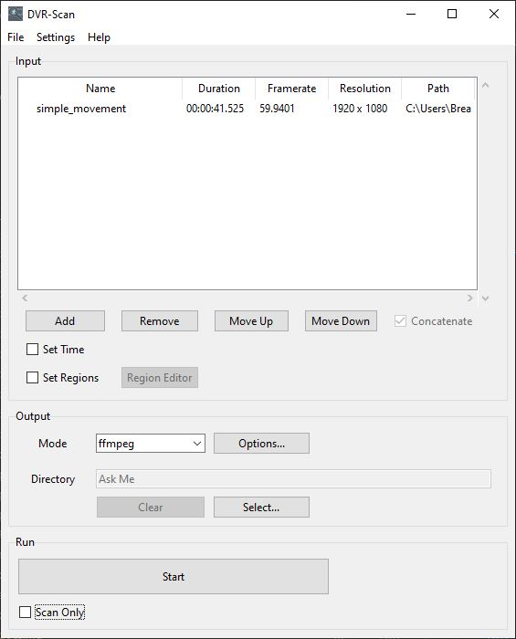
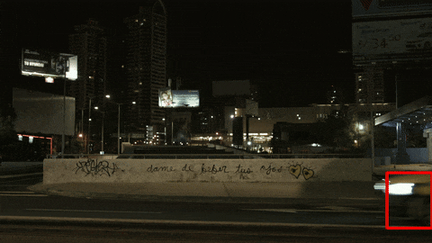

---
hide:
  - navigation
  - toc
---

<h1 id="dvr-scan-title">DVR-Scan</h1>
<h3 id="dvr-scan-subtitle">Find and extract motion events in videos.</h3>

------------------------------------------------------

!!! success "Latest Version: 1.8.1 (August 27, 2025)"

    
[:fontawesome-solid-book: User Guide](guide.md){ .md-button #changelog-button }[:fontawesome-solid-bars: &nbsp; Documentation](docs.md){ .md-button #documentation-button }[:fontawesome-solid-gear: &nbsp; Resources](changelog.md){ .md-button #download-button }

------------------------------------------------------

DVR-Scan is a command-line application that **automatically detects motion events in video files** (e.g. security camera footage).  DVR-Scan looks for areas in footage containing motion, and saves each event to a separate video clip.  DVR-Scan is free and open-source software, and works on Windows, Linux, and Mac.

## Quickstart :fontawesome-brands-windows::fontawesome-brands-apple::fontawesome-brands-linux:

### UI

Launch DVR-Scan from the shortcut or run the `dvr-scan-app` command.  Press **Add** to add your input videos, and press **Start** to find and extract segments with motion:

To limit detection to certain areas, press **Set Regions** and use [the **Region Editor**](guide.md#region-editor). Motion sensitivity can be adjusted under **Settings -> Motion**.  See the [User Guide](guide.md) for more information.

### CLI

Scan `video.mp4` (separate clips for each event):

    dvr-scan -i video.mp4

Only scan a region of interest ([see user guide](guide.md#region-editor) or hit `Ctrl + H` for controls):

    dvr-scan -i video.mp4 -r

Draw boxes around motion:

    dvr-scan -i video.mp4 -bb

Use `ffmpeg` to extract events:

    dvr-scan -i video.mp4 -m ffmpeg

Once installed, see [the user guide](guide.md) to get started, try one of the examples above, or type `dvr-scan --help`. Press `Ctrl + C` to stop processing at any time.

See the [documentation](docs.md) for a complete description of all [command-line](docs.md#dvr-scan-options) and [config file](docs.md#config-file) settings.
